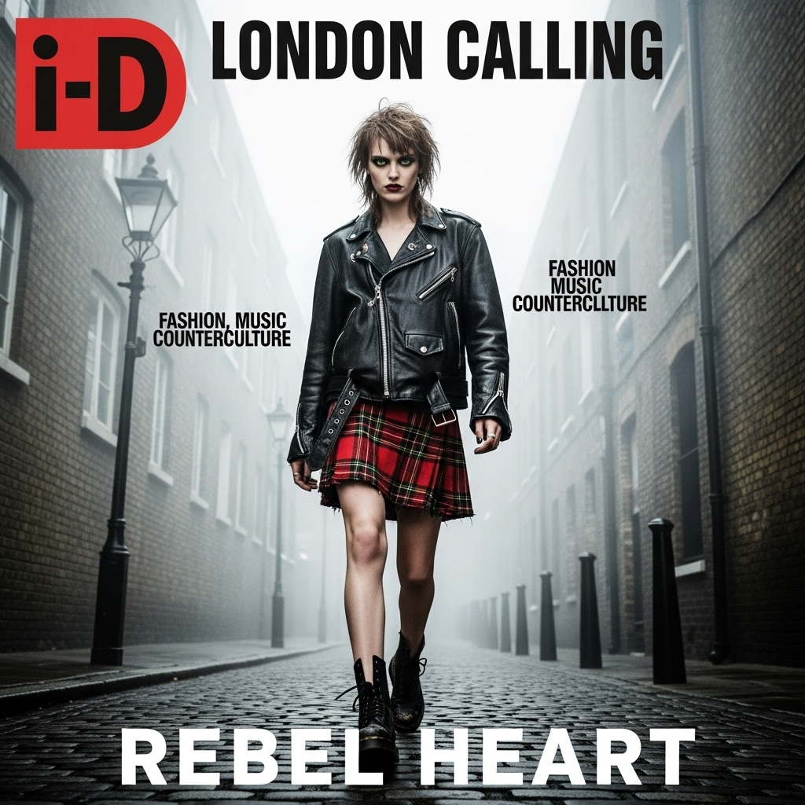

# 自动生成的文档

A striking fashion magazine cover for "i-D" or "Dazed" magazine. A low-angle medium shot of a rebellious British model with sharp green eyes and a messy bob hairstyle. She is walking confidently through a foggy, cobblestone alley in London. She wears a vintage leather biker jacket over a Vivienne Westwood-style tartan plaid skirt, and chunky Dr. Martens boots. Her expression is defiant, with a direct, challenging gaze at the camera. The 
atmosphere is moody and cinematic, with thick fog blurring the old brick buildings in the background. Photographed in the raw, high-contrast style of David Bailey, 35mm film grain, desaturated color palette. Bold, gritty typography for the cover lines. --ar 4:5 --style raw --v 6.0

## 包含的图片

下面是通过脚本一同上传的图片：

**提交时间**: Thu, 07 Aug 2025 05:26:39 GMT
