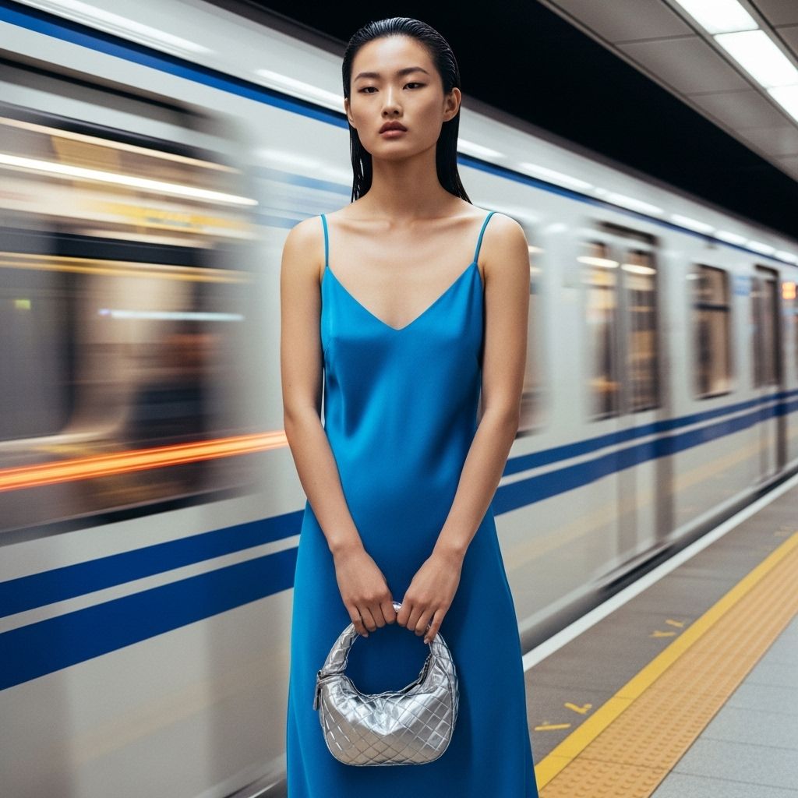

# 自动生成的文档

一张高端时尚杂志封面，《Vogue服饰与美容》风格。一位令人惊艳的中国超模，让人联想到贺聪，自信地站立在充满未来感的上海地铁站台上。35°C的酷热天气体现在她利落的湿发背头和冷艳而优雅的表情上。她身穿一件充满活力的电光蓝丝质吊带裙，与站台冰冷的金属色调形成鲜明对比。她手中拿着一个引人注目的银色Bottega Veneta Jodie迷你手袋。背景中，一辆地铁列车飞驰而过，形成动态的光影模糊效果。灯光充满电影感和戏剧性，混合了站台冰冷锐利的霓虹灯光与行驶列车留下的温暖光轨，风格类似格伦·卢奇福德。使用广角镜头拍摄，捕捉都市场景的宏大与活力。超写实，8K分辨率，焦点清晰地对准模特和手袋。--ar 4:5 --v 6.0 --style raw

## 包含的图片

下面是通过脚本一同上传的图片：

**提交时间**: Thu, 07 Aug 2025 14:58:46 GMT
