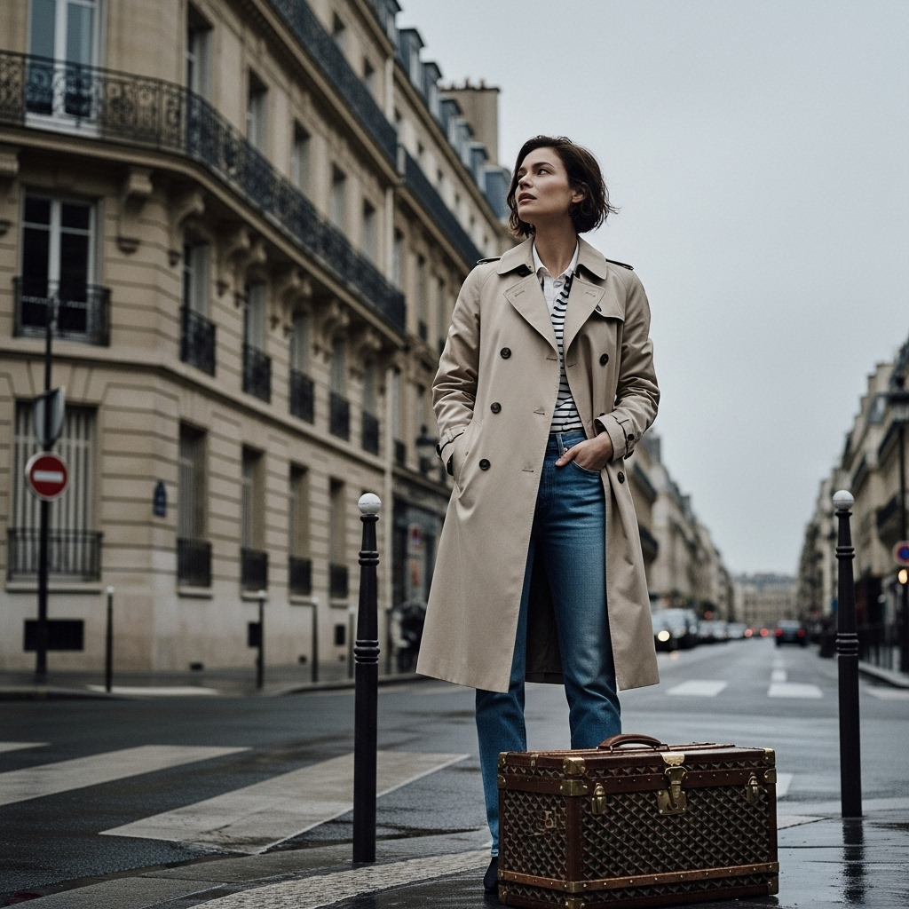

# 自动生成的文档

一张永恒经典的时尚杂志封面，风格如同《Harper's Bazaar》或彼得·林德伯格的摄影作品。一位神情深思的法国女演员，在一个多云的日子里，站立在经典的巴黎街角。她是法式时髦的缩影，穿着一件剪裁完美的米色风衣，内搭条纹衫和直筒牛仔裤。她身旁放着一个Goyard的复古风格棕色皮质行李箱。她的表情混合着希望与沉思，凝视着远方。背景是一栋带有铁艺阳台的、优美的奥斯曼风格建筑，街道微微湿润。摄影充满电影感和灵魂感，以彼得·林德伯格的标志性风格拍摄，光线柔和自然，色调低饱和度且富有情绪。全身照，细节极致，捕捉到风衣和行李箱皮革的质感。--ar 4:5 --v 6.0

## 包含的图片

下面是通过脚本一同上传的图片：

**提交时间**: Fri, 08 Aug 2025 05:33:51 GMT
