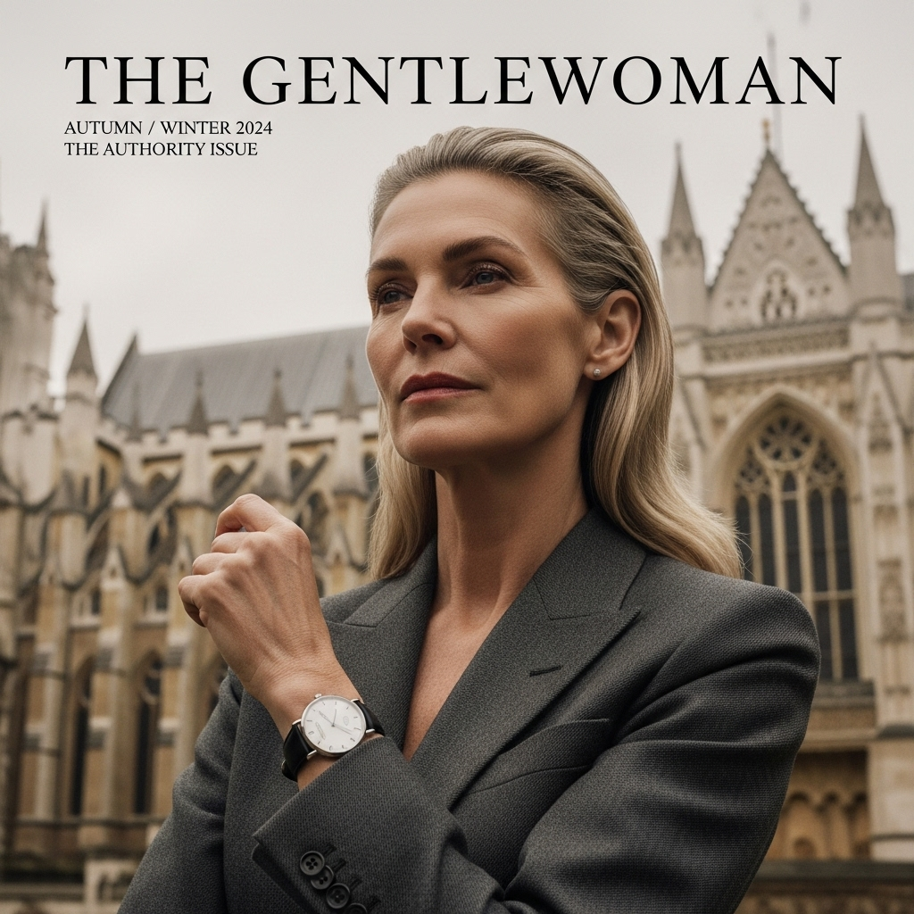

# 自动生成的文档

A sophisticated and powerful fashion magazine cover, for a publication like "The Gentlewoman" or "FT's How To Spend It". A medium close-up shot of a mature, elegant model with sharp, sculpted cheekbones and an intelligent, commanding gaze. She stands before the magnificent Gothic architecture of Westminster Abbey in London on a cloudy day. She is impeccably dressed in a charcoal grey, masterfully tailored wool suit from The Row. Her pose is subtle yet powerful, one hand gently raised, elegantly showcasing a classic Breguet Classique watch on her wrist. The lighting is soft and diffused, perfectly illuminating the intricate details of the abbey and the fine texture of her suit. The photography is extremely sharp and high-resolution, with a clean, polished aesthetic. The overall mood is one of timeless elegance and quiet authority. --ar 4:5 --v 6.0 --style raw

## 包含的图片

下面是通过脚本一同上传的图片：

**提交时间**: Fri, 08 Aug 2025 07:32:19 GMT
