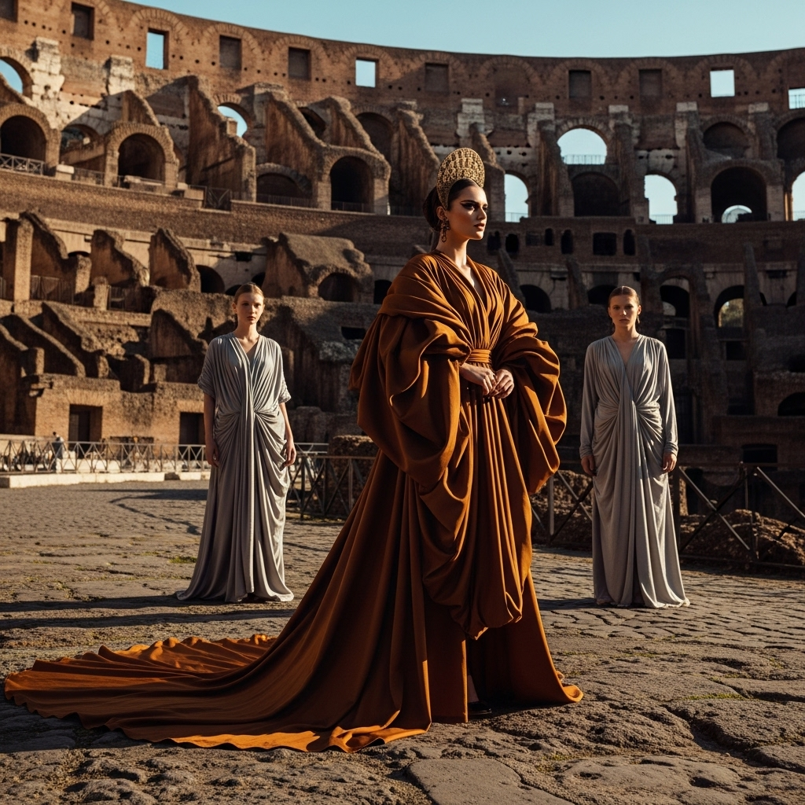

# 自动生成的文档

A high fashion editorial shot inside the ancient Roman Colosseum. A commanding model, embodying a modern empress or deity, stands with an intense, enigmatic gaze. She is adorned in a custom-designed, voluminous haute couture robe of luxurious, flowing fabric in a sophisticated earthy tone (e.g., deep ochre, terracotta, or muted stone grey), featuring dramatic drapes, sculptural folds, and a long train that cascades onto the weathered stone ground. Two to three ethereal supporting models, acting as her contemporary retinue or handmaids, elegantly accompany her, dressed in simpler, complementary flowing garments, positioned subtly around her to enhance her regal presence. The scene is bathed in the warm, golden light of the late afternoon sun, casting dramatic shadows and highlighting the monumental architecture. Full body shot or wide medium shot, capturing the grandeur of the setting and the model's powerful silhouette. Majestic, timeless, and ethereal atmosphere. High-end fashion photography, editorial quality, cinematic, painterly, sharp focus on the subjects with shallow depth of field, ultra-detailed, photorealistic, 8K.

## 包含的图片

下面是通过脚本一同上传的图片：

**提交时间**: Sun, 10 Aug 2025 16:04:32 GMT
