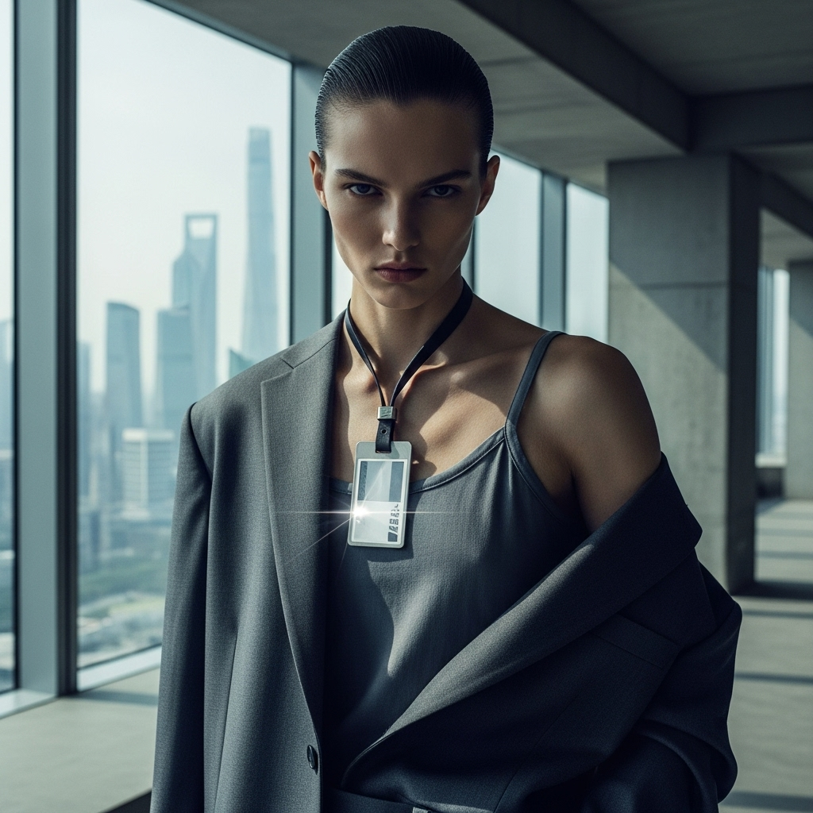

# 自动生成的文档

A high-fashion magazine cover shot in a minimalist, brutalist-inspired corporate office in Shanghai during a severe summer heatwave. Featuring an androgynous model with sharp, angular features and an intense, stoic gaze, wearing a deconstructed, oversized power suit in a cool charcoal grey breathable technical fabric, draped over one shoulder, revealing a sleek architectural camisole. The model's hair is slicked back into a tight, low bun. A sleek, metallic work badge hangs on a thick, minimalist leather lanyard, resting prominently against the collarbone, catching a glint of light. Medium close-up shot, powerful architectural pose. Floor-to-ceiling windows reveal a hazy, skyscraper-filled Shanghai cityscape in the background. Inspired by Peter Lindbergh's sleek commercial work and modern architectural photography. High contrast, cool color palette, muted tones, dramatic natural light from windows creating sharp shadows, sharp focus, slight film grain. --ar 2:3 --v 5.2

## 包含的图片

下面是通过脚本一同上传的图片：

**提交时间**: Sat, 16 Aug 2025 16:14:42 GMT
