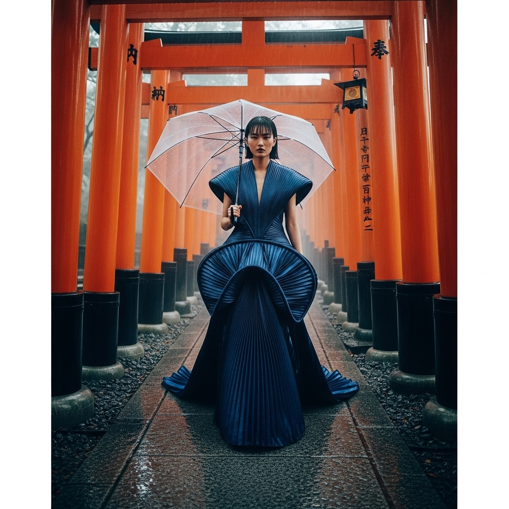

# 自动生成的文档

High-fashion magazine cover photo, cinematic atmosphere in the style of Wong Kar-wai and Nick Knight. A striking East Asian model with a wet-look micro-bangs bob and an intense, serene expression, walking through the Senbon Torii path at Fushimi Inari shrine, Kyoto. A continuous summer drizzle creates a misty, foggy mood and wet, reflective stone paths. The model wears a futuristic, sculptural haute couture gown of iridescent deep indigo fabric, style of Iris van Herpen. She holds a minimalist transparent designer umbrella. Medium shot, low angle view, dramatic perspective of repeating vermilion torii gates. Moody, atmospheric lighting, hyper-saturated colors, shallow depth of field, 35mm film grain. --ar 4:5 --style raw

## 包含的图片

下面是通过脚本一同上传的图片：

**提交时间**: Sun, 17 Aug 2025 16:52:51 GMT
