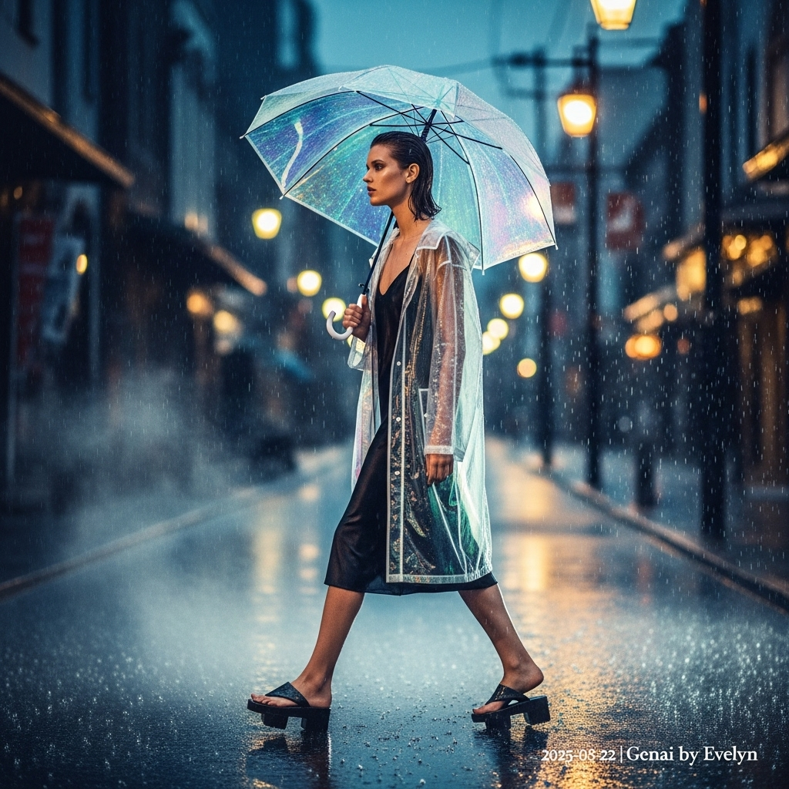

# 自动生成的文档

High-fashion magazine cover photo, set in Kobe's historic Kitano Ijinkan-gai district at dusk during a heavy, continuous drizzle. A statuesque, androgynous model with a serene, introspective expression and wet-look slicked-back hair walks on the reflective, steaming asphalt. She wears an oversized, semi-translucent iridescent techwear raincoat over a black silk slip, paired with avant-garde carbon fiber Geta-inspired platform sandals. She holds a large, transparent holographic vinyl umbrella that catches the ambient light, casting prismatic colors. The photography is cinematic and moody, in the style of Wong Kar-wai and Paolo Roversi, featuring saturated cool tones with warm highlights from street lamps. Shot on a 50mm f/1.4 lens, creating a shallow depth of field with soft focus and beautiful bokeh. Slow shutter speed to streak the falling rain. Ultra-realistic, 8K, high detail. In the bottom-right corner, add a small, minimalist white text overlay that reads: '2025-08-22 | Genai by Evelyn'.

## 包含的图片

下面是通过脚本一同上传的图片：

**提交时间**: Thu, 21 Aug 2025 15:28:31 GMT
