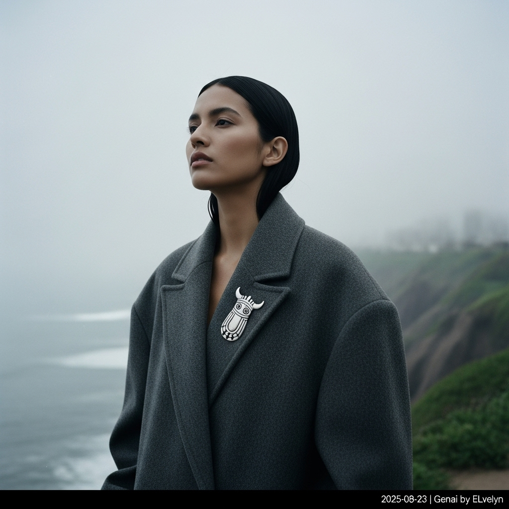

# 自动生成的文档

Vogue cover style, ultra-high resolution 8K fashion photography in the style of Paolo Roversi. A Peruvian model with strong, elegant features and a soulful gaze stands on the misty clifftops of Barranco, Lima. She wears an architectural, oversized coat in vicuña-toned alpaca wool. Her only accessory is a large, handcrafted silver Tupu pin on her lapel. The scene is enveloped in the soft, grey 'garúa' fog, with the Pacific Ocean barely visible below. The lighting is natural, diffused, and moody from the overcast sky. The color palette is desaturated and cool-toned. The composition is a medium-long shot, cinematic and atmospheric, with a subtle film grain. Add a small, clean, white text overlay in the bottom-right corner: '2025-08-23 | Genai by ELvelyn'.

## 包含的图片

下面是通过脚本一同上传的图片：

**提交时间**: Fri, 22 Aug 2025 18:48:29 GMT
