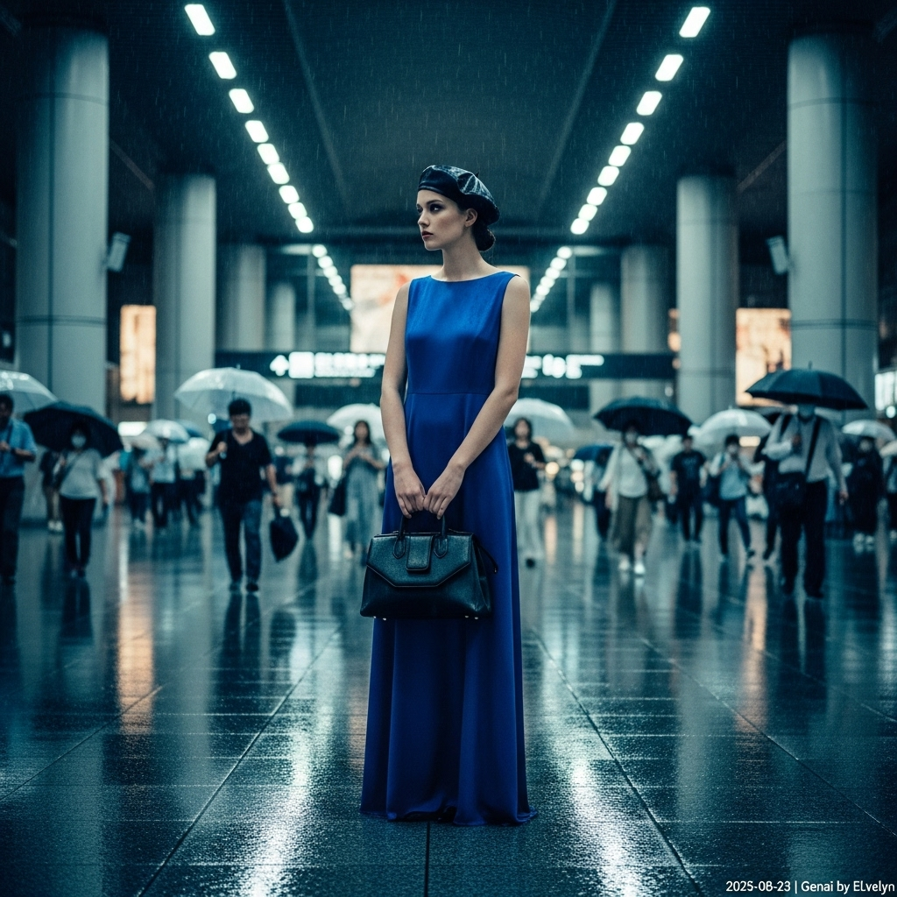

# 自动生成的文档

Vogue cover style, cinematic photograph of a high-fashion model with a serene, introspective gaze standing still inside the vast, futuristic Kyoto Station. The atmosphere is melancholic, set during a hot summer day with a slight continuous drizzle. She wears an elegant, floor-length minimalist formal gown made of sapphire blue silk and a classic black leather beret. She holds a structured architectural black leather handbag. The station's floors are wet and reflective, mirroring the neon and ambient lights. Commuters with umbrellas are blurred in motion in the background. The photography style is inspired by Christopher Doyle's work with Wong Kar-wai, featuring deep, saturated colors, high contrast, and a subtle film grain. Shot with a shallow depth of field from a slightly low angle to create a dramatic, atmospheric mood. At the bottom-right corner of the image, add a small, unobtrusive text overlay in white that reads: '2025-08-23 | Genai by ELvelyn'.

## 包含的图片

下面是通过脚本一同上传的图片：

**提交时间**: Fri, 22 Aug 2025 15:02:58 GMT
