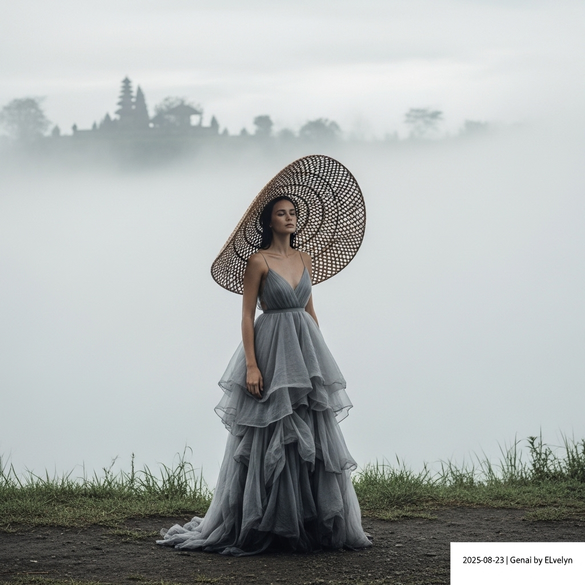

# 自动生成的文档

Vogue cover style, ultra high-fashion photography. A serene model with an otherworldly presence stands in the misty highlands of Munduk, Bali. She wears a flowing, floor-length gown of layered organza and raw silk in shades of mist grey, its texture damp with dew. An exaggerated, oversized hand-woven rattan sun hat is tilted back on her head like a sculptural halo. The background is a dense, white fog, with the faint silhouette of an ancient temple. The atmosphere is mystical and contemplative. The photography style is inspired by Paolo Roversi, featuring soft, diffused natural light, a desaturated color palette, and a subtle film grain. Medium full-body shot from a slightly low angle. Finally, add a small, minimalist white text overlay in the bottom-right corner that reads: '2025-08-23 | Genai by ELvelyn'.

## 包含的图片

下面是通过脚本一同上传的图片：

**提交时间**: Fri, 22 Aug 2025 15:57:23 GMT
