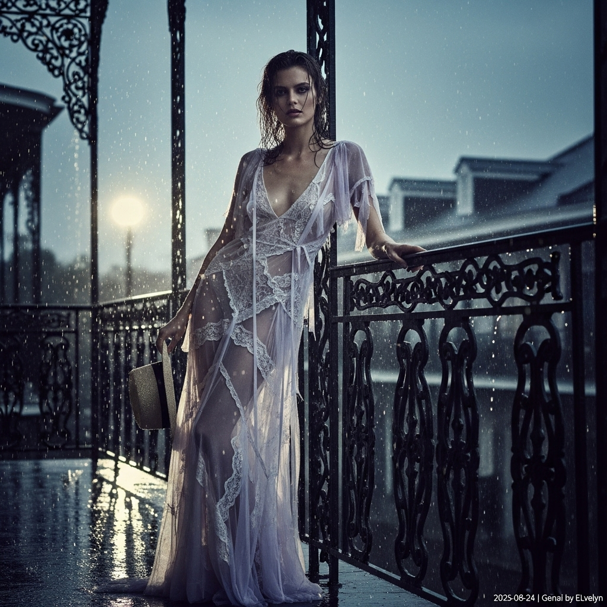

# 自动生成的文档

High-fashion magazine cover, photography in the style of Paolo Roversi and Deborah Turbeville. A soulful model with an enigmatic gaze and damp, wavy dark hair stands on a historic wrought-iron balcony in the New Orleans French Quarter during a heavy rain shower. She wears a deconstructed, floor-length gown of pale lavender sheer silk organza with frayed lace details, clinging slightly in the humidity. She leans against the railing, holding a rain-dampened, wide-brimmed straw hat in one hand. The scene is a medium-full shot from a slightly low angle. The atmosphere is moody and cinematic, with soft, diffused late-afternoon light filtering through storm clouds. Rain streaks and glistens on the ironwork. Desaturated color palette with deep blacks and moody blues. Use of soft focus, visible film grain, and a subtle light bloom effect on wet surfaces. Utmost realism and detail. Final instruction: Add a small, unobtrusive white text overlay in the bottom-right corner that reads: '2025-08-24 | Genai by ELvelyn'.

## 包含的图片

下面是通过脚本一同上传的图片：

**提交时间**: Sat, 23 Aug 2025 00:31:01 GMT
