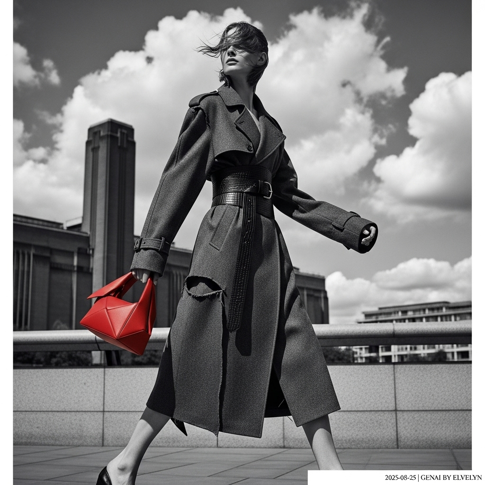

# 自动生成的文档

High-fashion magazine cover photo, full body shot of a model with strong bone structure walking on London's South Bank. She wears an oversized, deconstructed charcoal grey wool trench coat, cinched with a wide belt. She holds a single, sculptural, architectural handbag in vibrant scarlet red. The background is the Tate Modern under a dramatic sky with forming clouds, creating a soft, diffused light. The overall aesthetic is cinematic and atmospheric, photographed in the style of Peter Lindbergh. Desaturated color palette dominated by greys, with the red bag as the only pop of color. Subtle, fine film grain. In the bottom-right corner, add a small, elegant white text overlay: '2025-08-25 | Genai by ELvelyn'.

## 包含的图片

下面是通过脚本一同上传的图片：

**提交时间**: Sun, 24 Aug 2025 15:18:09 GMT
