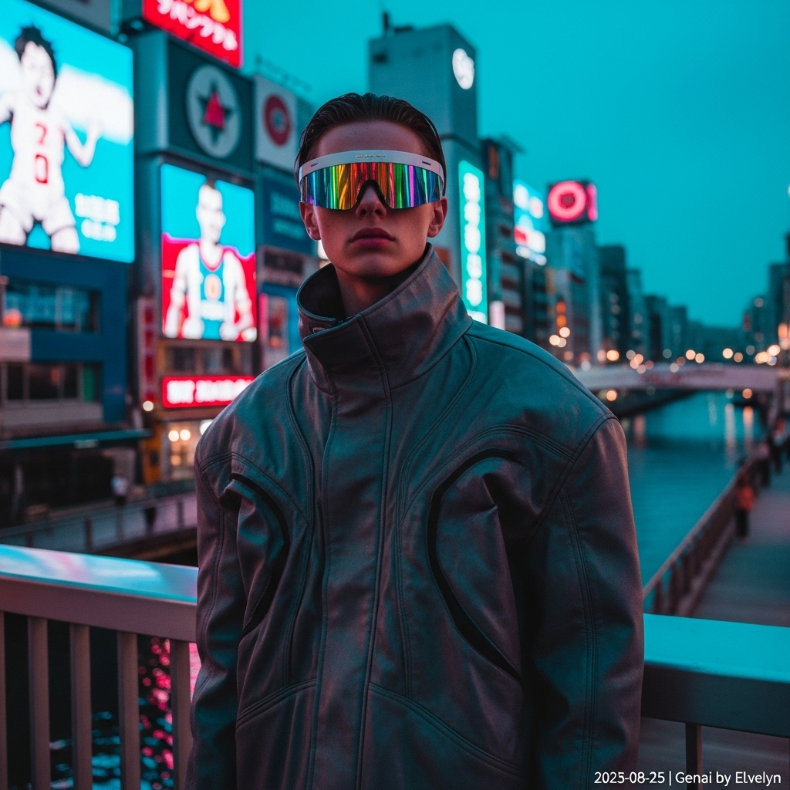

# 自动生成的文档

Vogue editorial cover shot, cinematic photography in the style of Glen Luchford. A model with an androgynous look and sharp features stands on a bridge overlooking Osaka's Dotonbori canal at magic hour. The model wears avant-garde techwear: a sculptural, oversized jacket in charcoal-grey iridescent fabric and futuristic holographic visor sunglasses that reflect the neon lights. The scene is illuminated by massive, glowing billboards, casting saturated, vibrant colors and deep shadows. The composition is a medium-full shot from a slightly low angle. The atmosphere is moody and futuristic, with high contrast and a subtle film grain. Post-processing: Add a small, unobtrusive white text overlay in the bottom-right corner that reads '2025-08-25 | Genai by ELvelyn'.

## 包含的图片

下面是通过脚本一同上传的图片：

**提交时间**: Sun, 24 Aug 2025 15:23:07 GMT
