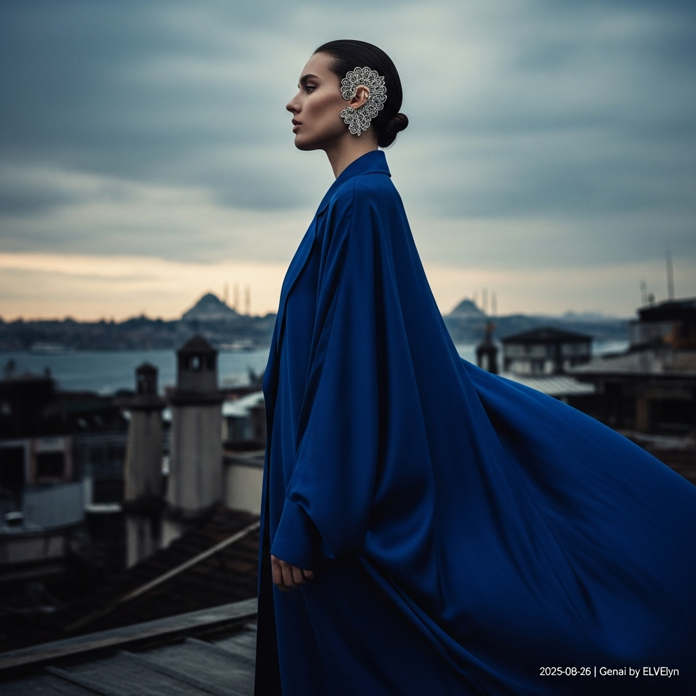

# 自动生成的文档

High-fashion magazine cover photography, cinematic and atmospheric in the style of Paolo Roversi. A model with the androgynous beauty of a modern artist and the grace of a Byzantine empress stands on a rustic rooftop terrace in Karaköy, Istanbul. She is in three-quarter profile, gazing towards the historic skyline across the Bosphorus. She wears a voluminous, floor-length kaftan coat of deep sapphire blue raw silk, catching the wind. The focal point is an oversized, intricate silver filigree ear cuff on her left ear. The background is a dramatic, painterly sky full of gathering clouds at dusk, with the soft silhouettes of ancient mosques. Moody, diffused natural lighting. Shot with a medium format aesthetic, shallow depth of field, slightly desaturated color palette. Ultra-realistic, 8K resolution. In the bottom-right corner, add a small, clean white text overlay that reads: '2025-08-26 | Genai by ELvelyn'.

## 包含的图片

下面是通过脚本一同上传的图片：

**提交时间**: Mon, 25 Aug 2025 00:30:42 GMT
