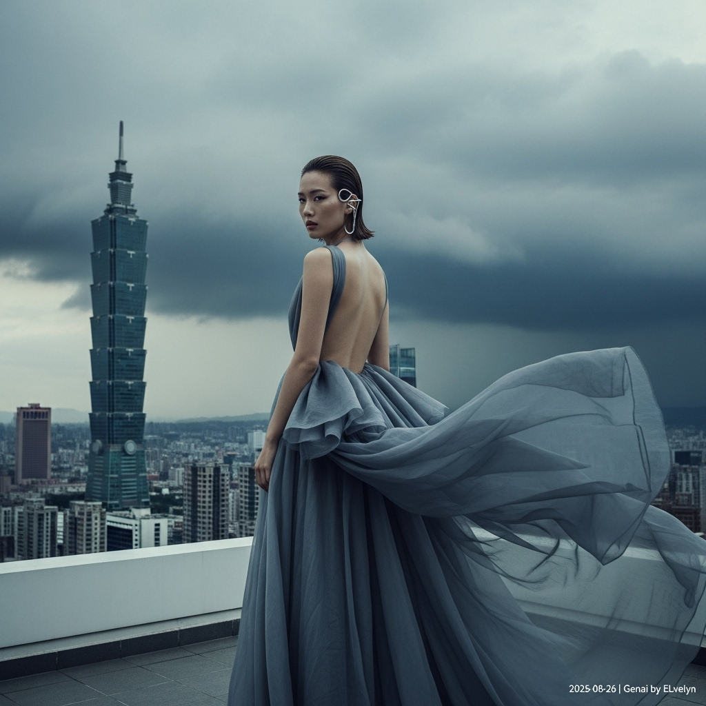

# 自动生成的文档

High-fashion magazine cover photo, cinematic style. A striking East Asian model stands on a minimalist penthouse balcony overlooking the Taipei skyline, with Taipei 101 in the background. Dramatic, dark storm clouds are gathering in the sky. The model has a sophisticated wet-look hairstyle, dewy skin, and an expression of quiet intensity. She wears a voluminous, backless, avant-garde organza gown in a storm-grey color that billows in the wind. Her only accessory is a single, large, sculptural chrome ear cuff. The photography uses soft, moody, diffused lighting from the overcast sky. The color palette is cool and desaturated. The composition is a medium-full shot from a slightly low angle, capturing her elegant, powerful pose against the epic urban landscape. In post-processing, add a small, minimalist white text overlay in the bottom-right corner that reads: '2025-08-26 | Genai by ELvelyn'.

## 包含的图片

下面是通过脚本一同上传的图片：

**提交时间**: Mon, 25 Aug 2025 15:18:34 GMT
