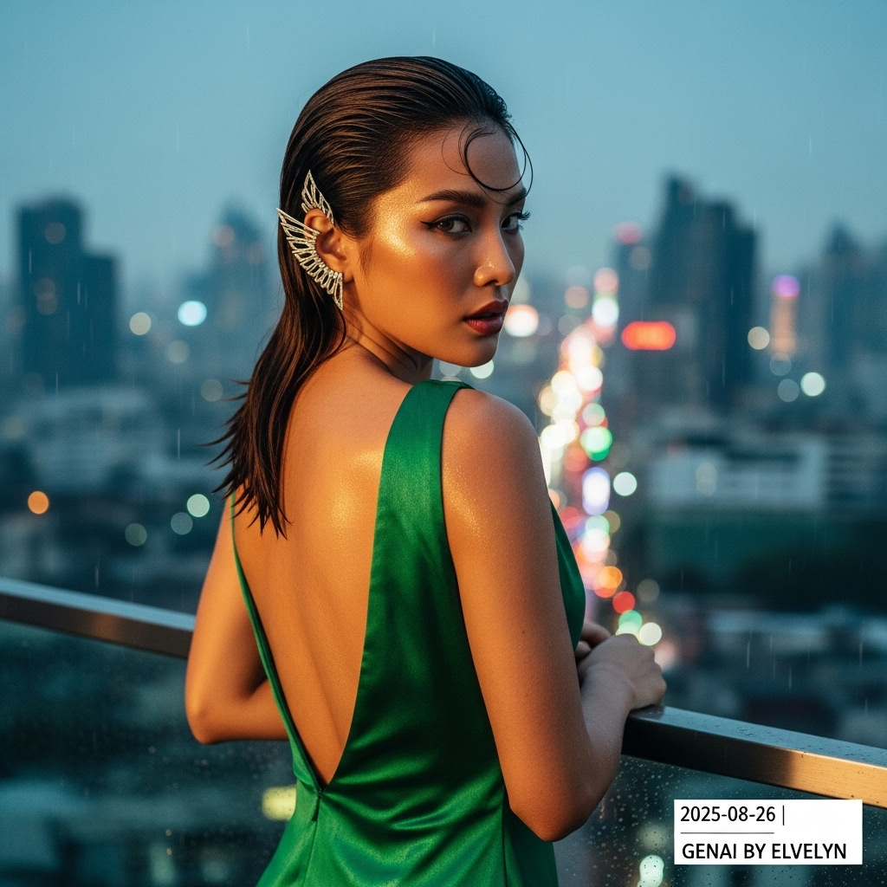

# 自动生成的文档

High-fashion magazine cover photo, cinematic and atmospheric. A striking Southeast Asian model stands on a covered balcony of a luxury rooftop bar overlooking Bangkok at rainy dusk. She wears a contemporary, backless gown of lustrous emerald green Thai silk that subtly clings to her form. Her hair is styled in a chic wet-look, slicked back. Her skin has a dewy, glistening sheen. She turns her head over her shoulder, a look of quiet intensity in her smoldering gaze, lips slightly parted. An intricate, modern silver ear cuff inspired by Thai motifs adorns her ear. The background is a beautiful bokeh of the sprawling, neon-lit city seen through a veil of rain. Lighting is a dramatic mix of soft twilight and vibrant city neons. Shot with a shallow depth of field, ultra-realistic, 8K, sophisticated and alluring. In post-processing, add a small, minimalist white text overlay in the bottom-right corner: '2025-08-26 | Genai by ELvelyn'.

## 包含的图片

下面是通过脚本一同上传的图片：

**提交时间**: Mon, 25 Aug 2025 15:09:27 GMT
