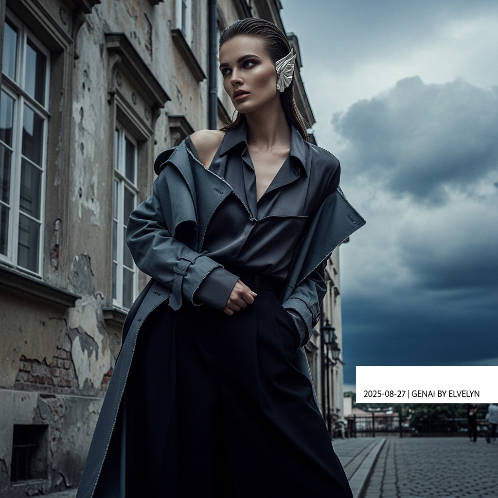

# 自动生成的文档

High-fashion magazine cover photo, style of Vogue Italia. A striking female model with chiseled features and a smoldering gaze poses on a street in Warsaw's historic Praga District. Her hair is styled in a wet-look, slicked back. She wears avant-garde layering: a deconstructed slate-grey trench coat over a charcoal silk blouse subtly unbuttoned at the collarbone, and wide-leg black trousers. A large, sculptural silver ear cuff is her only jewelry. The background is a weathered, historic building facade. The atmosphere is moody and cinematic, under a dramatic sky with forming clouds. The lighting is soft and diffused, creating dramatic chiaroscuro shadows. Desaturated cool-toned color palette, ultra-realistic, subtle film grain, shot with a 85mm lens. In post-processing, add a small, minimalist white text overlay in the bottom-right corner: '2025-08-27 | Genai by ELvelyn'.

## 包含的图片

下面是通过脚本一同上传的图片：

**提交时间**: Tue, 26 Aug 2025 00:30:48 GMT
