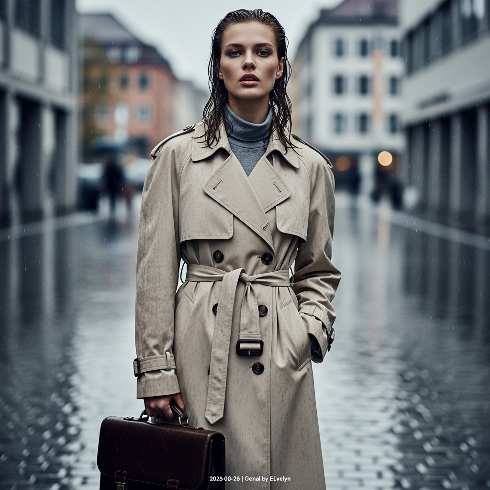

# 自动生成的文档

High-fashion magazine cover photo, cinematic style of Peter Lindbergh. A striking female model with intelligent features and damp, rain-kissed hair stands on the glistening, wet cobblestone streets of Munich's Kunstareal during a slight rain shower. She wears an elegant, oversized beige trench coat, belted loosely, with a glimpse of a charcoal turtleneck underneath. Her gaze is intense and contemplative, lips slightly parted. She holds a vintage-inspired dark brown leather briefcase in one hand. The atmosphere is melancholic and romantic. Shot with a shallow depth of field, the background architecture is softly blurred. The lighting is diffused and moody, characteristic of an overcast day, with reflections shimmering on the wet ground. The image has a slight film grain and desaturated color palette. In the bottom-right corner, add a small, white text overlay: '2025-08-28 | Genai by ELvelyn'.

## 包含的图片

下面是通过脚本一同上传的图片：

**提交时间**: Wed, 27 Aug 2025 00:30:44 GMT
