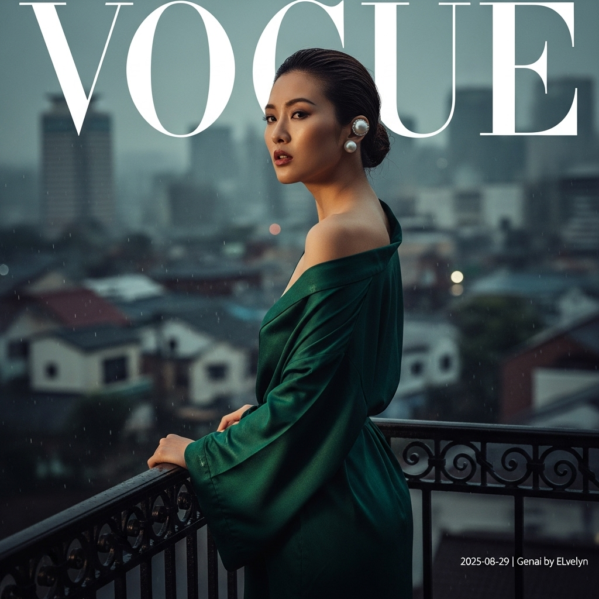

# 自动生成的文档

High-fashion magazine cover photo, Vogue aesthetic. A strikingly elegant East Asian female model stands on a wrought-iron balcony in Kobe's historic Kitano-cho district during a late afternoon drizzle. She wears a modern Japonisme silk robe in deep emerald green, draped sensually off one shoulder, the fabric clinging subtly to her form in the humid air. Her hair is a wet-look chignon, her expression is one of quiet intensity, lips slightly parted. A single, oversized sculptural pearl ear cuff is her only accessory. The photography is cinematic and atmospheric, with soft, diffused light creating dramatic chiaroscuro. Shallow depth of field blurs the glistening, rain-slicked city below. Moody, rich color palette. Shot on a 50mm lens, hyper-realistic, 8K. In the bottom-right corner, add a small, clean white text overlay that reads: '2025-08-29 | Genai by ELvelyn'.

## 包含的图片

下面是通过脚本一同上传的图片：

**提交时间**: Thu, 28 Aug 2025 00:30:42 GMT
