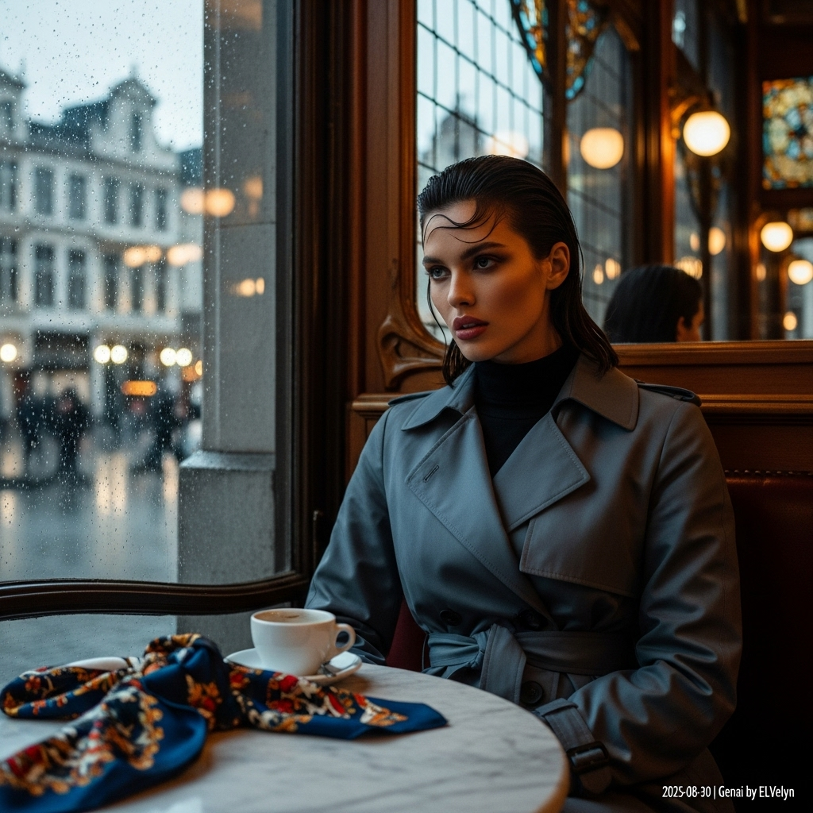

# 自动生成的文档

High-fashion magazine cover photo, cinematic style. A striking female model with dark, wet-look hair sits inside an opulent Art Nouveau café in Brussels. She wears a modern, slate-grey trench coat over a black turtleneck. Her gaze is intense and confident, lips slightly parted. Raindrops streak the large window beside her, through which the blurred lights of a city square are visible. On the marble table lies a vibrantly patterned silk scarf next to a coffee cup. The lighting is a dramatic mix of cool, diffused window light and warm interior glow, creating a soft chiaroscuro effect. Shot on a Hasselblad, shallow depth of field, medium-close-up. The overall mood is one of sophisticated, sweet melancholy. In post-processing, add a small, minimalist white text overlay in the bottom-right corner: '2025-08-30 | Genai by ELvelyn'.

## 包含的图片

下面是通过脚本一同上传的图片：

**提交时间**: Fri, 29 Aug 2025 00:30:38 GMT
