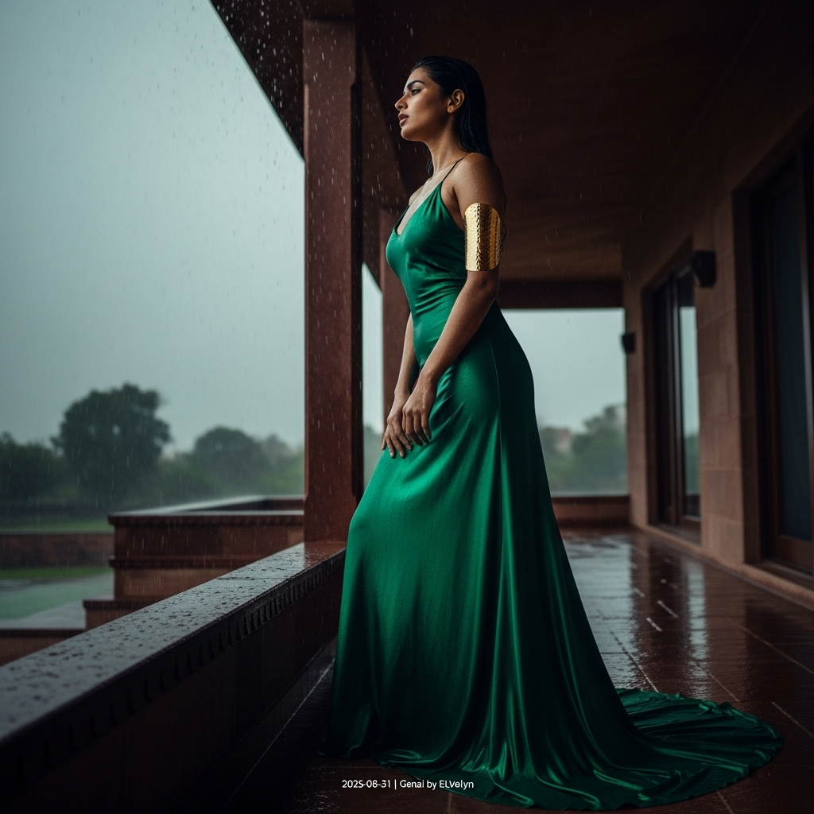

# 自动生成的文档

High-fashion magazine cover shot, cinematic and atmospheric. A striking South Asian female model stands on the covered stone veranda of a modern, minimalist haveli in New Delhi during a torrential monsoon thunderstorm. Her dark hair is drenched and slicked back, her skin glistens with raindrops. She wears a magnificent, floor-length gown of emerald green silk, wet and clinging gracefully to her form, revealing an elegant silhouette. Her expression is one of quiet intensity, a smoldering gaze directed towards the storm, lips slightly parted. She wears a single, bold, hammered gold sculptural arm cuff that provides a warm contrast. The lighting is dramatic chiaroscuro from the grey, stormy sky, sculpting her features. The shot is a medium-full portrait, with a low camera angle emphasizing her powerful stance. Ultra-realistic, 8K, high detail, shot on film. In post-processing, add a small, minimalist white text overlay in the bottom-right corner that reads '2025-08-31 | Genai by ELvelyn'.

## 包含的图片

下面是通过脚本一同上传的图片：

**提交时间**: Sat, 30 Aug 2025 00:30:43 GMT
