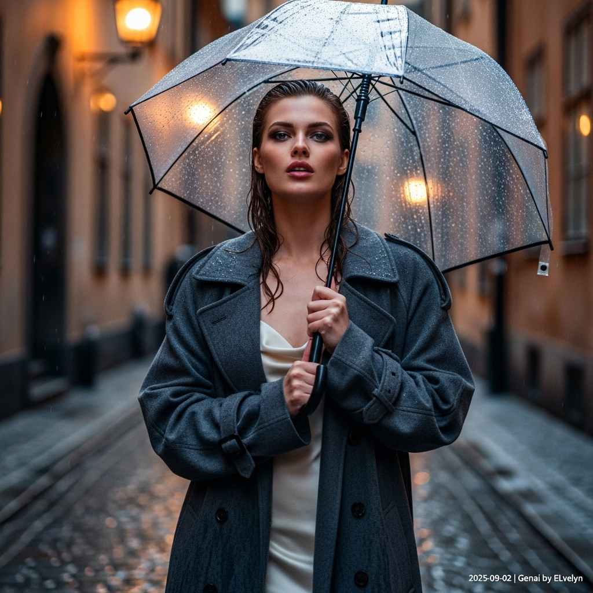

# 自动生成的文档

High-fashion magazine cover, ultra-high definition, cinematic photography. A striking woman with stormy grey eyes and damp auburn hair stands in a narrow, glistening cobblestone alley in Gamla Stan, Stockholm during a slight drizzle at dusk. She exudes a quiet, powerful confidence, her lips slightly parted. She wears an oversized charcoal cashmere trench coat, damp with rain, subtly revealing a cream silk slip dress beneath. She holds a transparent umbrella, its surface dotted with raindrops creating a bokeh effect from a warm café light that casts a gentle glow on her face. Her pose is elegant, her gaze direct and intense. The atmosphere is moody, sophisticated, and alluring. Shot with a shallow depth of field, cool color grading with a touch of warmth. In the bottom-right corner, add a small, white text overlay that reads: '2025-09-02 | Genai by ELvelyn'.

## 包含的图片

下面是通过脚本一同上传的图片：

**提交时间**: Mon, 01 Sep 2025 00:30:39 GMT
