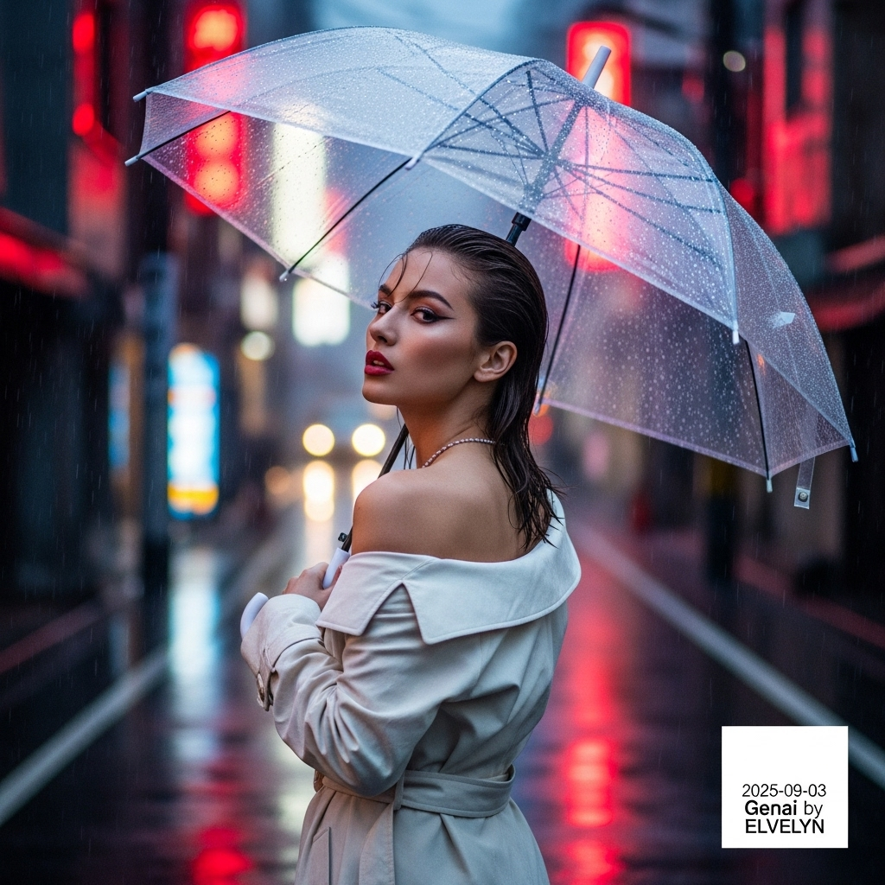

# 自动生成的文档

High-fashion magazine cover, cinematic photography in the style of Wong Kar-wai. A striking Japanese model with a chic wet-look hairstyle stands in a narrow, rain-slicked street of Fukuoka's Nakasu district at dusk. The atmosphere is misty with continuous drizzle. She gives a smoldering gaze over her shoulder, lips slightly parted. She wears an elegant, deconstructed off-white trench-coat, worn off one shoulder revealing her collarbone. She holds a designer clear vinyl umbrella beaded with raindrops. The background is a beautiful bokeh of blurred red and blue neon signs reflecting on the wet asphalt. Shot with a prime lens, extremely shallow depth of field, dramatic ambient neon lighting. Ultra-realistic, 8K, high detail. Finally, add a small, minimalist white text overlay in the bottom-right corner that reads: '2025-09-03 | Genai by ELvelyn'.

## 包含的图片

下面是通过脚本一同上传的图片：

**提交时间**: Tue, 02 Sep 2025 00:30:42 GMT
