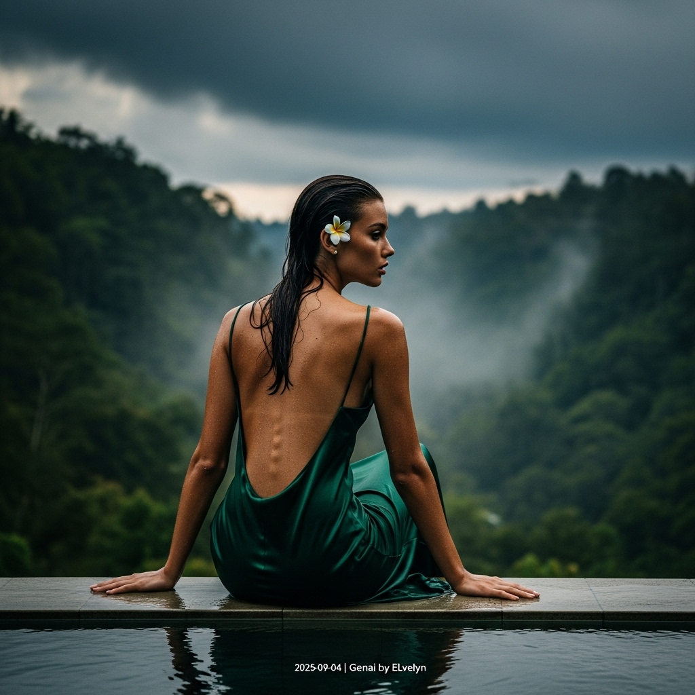

# 自动生成的文档

High-fashion magazine cover photo, cinematic and painterly. A strikingly serene female model is seated gracefully on the wet stone edge of an infinity pool at a secluded Ubud villa. Her back is elegantly arched, showcased by a floor-length, backless silk-satin slip dress in a deep emerald green that subtly clings to her form. Her dark hair is damp and swept back, skin gleaming with a humid sheen. She turns her head in a three-quarter profile, her intense, quiet gaze fixed on the horizon where dramatic, heavy storm clouds are gathering. A single white frangipani flower is tucked behind her ear. The scene is illuminated by dramatic, diffused pre-storm light (chiaroscuro). The background is a lush, misty jungle ravine. Shot with a professional 85mm lens, shallow depth of field, Vogue aesthetic. In post-processing, add a small, minimalist white text overlay in the bottom-right corner: '2025-09-04 | Genai by ELvelyn'.

## 包含的图片

下面是通过脚本一同上传的图片：

**提交时间**: Wed, 03 Sep 2025 00:30:38 GMT
