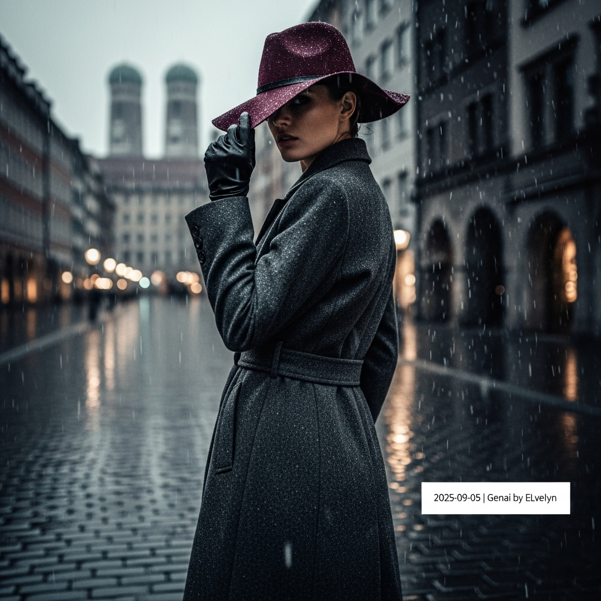

# 自动生成的文档

High-fashion magazine cover shot in the style of Vogue Italia. A statuesque woman with an intense gaze stands on a wet, glistening cobblestone street in Munich during a dramatic thunderstorm of rain and snow. She wears a impeccably tailored, long charcoal grey wool coat and a statement wide-brimmed felt hat in deep burgundy, tilted to cast a mysterious shadow over her eyes. Her pose is powerful and elegant, glancing over her shoulder at the camera. Cinematic, high-contrast, low-light photography, desaturated color palette with a moody, atmospheric feel. Shallow depth of field, focusing on the texture of her damp coat and the droplets on her hat. In the final image, add a small, minimalist white text overlay in the bottom-right corner that reads: '2025-09-05 | Genai by ELvelyn'.

## 包含的图片

下面是通过脚本一同上传的图片：

**提交时间**: Thu, 04 Sep 2025 00:30:42 GMT
